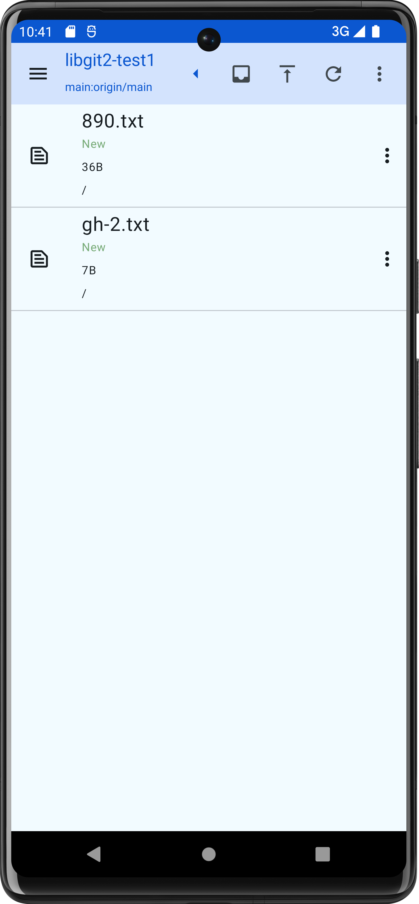
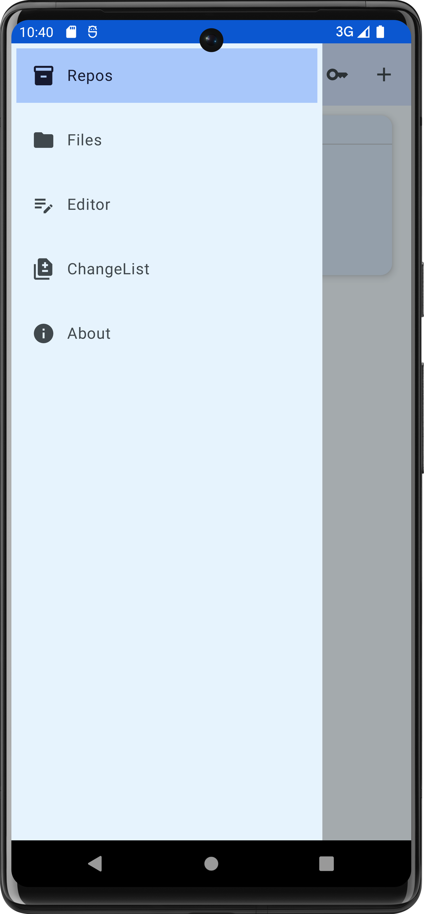
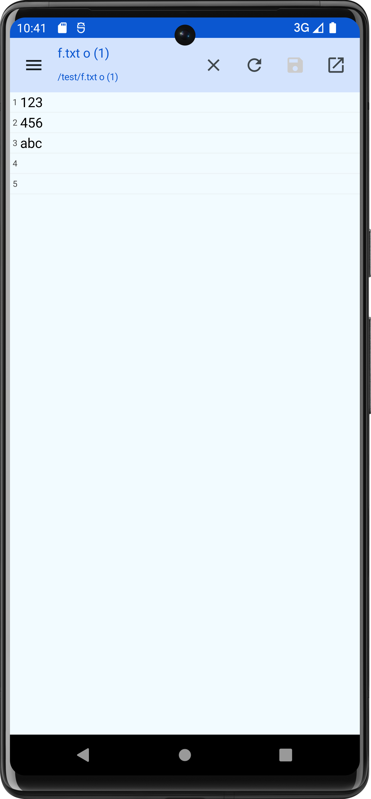
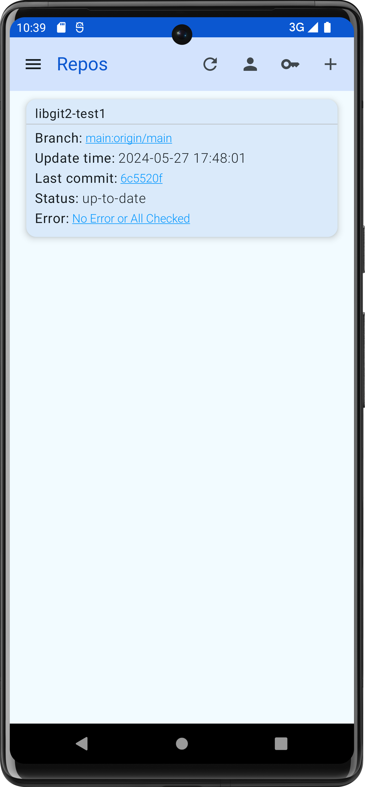

# PuppyGit
PuppyGit is A Git Client for Android, Open Source and No Ads and Free to use


## Author
PuppyGit made by Bandeapart1964 of catpuppyapp

### If you like this app, please Star this project and share it to your friends who they need.


## Download
<a href=https://github.com/Bandeapart1964/PuppyGitPro/releases>Github Release</a>

## PuppyGit + Notes App = A Free Cross-platform Sync Way!
Not only sync codes, You can use PuppyGit sync your notes repository create by note-taking apps like: <a href="https://github.com/obsidianmd/obsidian-releases">Obsidian</a> / <a href="https://github.com/gsantner/markor">Markor</a> or Other!

## Screenshots
<div>




</div>


## Features
- fetch
- merge
- push
- files explorer
- simple file editor (only utf8 supported)
- commit history (git log)
- shallow clone
- rebase
- cherry-pick
- patch
- reflog
- tags manage
- stash manage
- submodules manage


## TODO (welcome pr)
- multi cherry-pick
- optimize Editor performance
- add colors and accept buttons for accept ours/theirs in Editor when merge mode on
- highlighting keyword when finding in Editor
- support more encoding for Editor(now only supported utf8)
- view commit history as a interactable tree
- view history of file(plan: add menu item in Files page single item menu, and Editor page top bar menu. if file is not in a git repo, show a toast)


## About ssh
Idk how support ssh on Android, so PuppyGit only support https for now, if you know how support ssh, please make a pr or give me some hints for that


## Build
import project to Android Studio, then build, that's all.


## Security
For reduce risk of password leak, Your passwords of git repos(e.g. github) are encrypted saved in PuppyGit's database on your device, the password of password encryptor is not open source for security reason, if you want build PuppyGit by yourself, you should update the password and version properly:
- update `EncryptorImpl.kt`, set your password encryptor, or simple use default encryptor
- set your encryptor version and password in `PassEncryptHelper.kt`, the password must enough to long and better don't make it be public

note: you should not change the passwords of old versions of password encryptors, if changed, when you upgrade app will can't decrypt the passwords encrypted by encryptor with old passwords, then all saved passwords on user device will be invalid, users must delete all credentials, then restart app, then re create credentials again.


## Help translate
1. Download <a href="https://github.com/Bandeapart1964/PuppyGit/blob/main/app/src/main/res/values/strings.xml">strings.xml</a>
2. Translate the file's values to your language, e.g.```<help>help translate</help>```to```<help>帮助翻译</help>```
3. Create a issue attaching the file you was translated, the issue should tell which language you traslated to

Then I'll add your language into PuppyGit in furthur version

*NOTE: the string in strings.xml like "ph_a3f241dc_NUMBER" are place holders, the last NUMBER is order, e.g. a string resource ```<str1>name: ph_a3f241dc_1, age: ph_a3f241dc_2</str1>```, will replaced when running, it maybe will show as: ```"name: abc, age: 123"```, if you have mistake with the order number, e.g.```<str1>name: ph_a3f241dc_2, age: ph_a3f241dc_1</str1>```, it may cause app show wrong text like ```"name: 123, age: abc"```


## Comments in codes
this project has many chinese comments, and some comments are out-of-date or nonsense, I have no plan clean them, but if you read the codes, and you wonder know some comments meaning, try translator or ask me is ok


## Donate
I expect some donations, it may help I keep continuously maintenance this project.<br>
my bitcoin addr: bc1q0yzt0kxvj4f4qvamrx2q7mahr40leun57m7sfd
